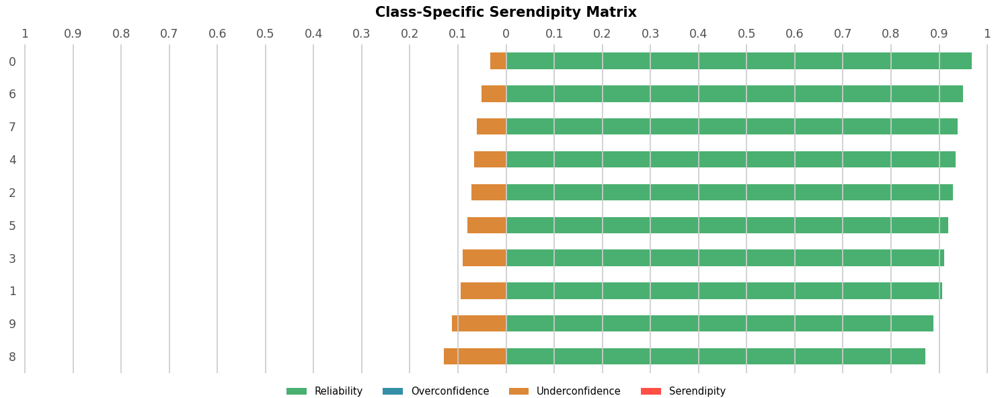

# Serendipity Matrix 

The package provides the methods to provide the serendipity matrix and for visualizing the serendipity matrix in a horizontal bar chart. The serendipity matrix is an innovative method to understand the behavior of a prediction model for classification problems. 

This matrix provides information about the degree of certainty that the classifier has in its own predictions, indicating whether it is robust and reliable or uncertain and doubtful. This method has two variants: the class-independent serendipity
matrix and the class-specific serendipity matrix depending on the kind of analysis required. 

By analyzing the data provided by them, our goal is to improve the reliability and explainability of prediction models and to provide users with a clearer understanding of why a model is certain or uncertain about its predictions.

## Installation

Serendipity Matrix can be installed from [PyPI](https://pypi.org/project/serendipity_matrix/)

```bash
pip install serendipity_matrix
```

Or you can clone the repository and run:

```bash
pip install .
```

## Sample usage

```python
from serendipity_matrix import class_indep_matrix, class_spec_matrix, plot_class_spec
from sklearn.ensemble import RandomForestClassifier
from sklearn.datasets import load_digits

# Loads the dataset
X, y = load_digits(return_X_y=True)

# Training and predict
model = RandomForestClassifier(random_state=0).fit(X, y)
result = model.predict_proba(X)

# Calculates and prints the class-independent serendipity matrix
ci_matrix = class_indep_matrix(y, result)
print(ci_matrix)

# Calculates and prints the class-specific serendipity matrix
cs_matrix = class_spec_matrix(y, result)
print(cs_matrix)

# Plots the class-specific serendipity matrix
plot_class_spec(y, result)
```

## Result sample

### Class-independent serendipity matrix

|Reliability|Overconfidence|Underconfidence|Serendipity|
|:---------:|:------------:|:-------------:|:---------:|
| 0.921169  |      0.0     |    0.078831   |     0.0   |

### Class-specific serendipity matrix

|CLASS_NAME|Reliability|Overconfidence|Underconfidence|Serendipity|
|:--------:|:---------:|:------------:|:-------------:|:---------:|
|    0     |  0.967680 |     0.0      |    0.032320   |     0.0   |
|    1     |  0.905674 |     0.0      |    0.094326   |     0.0   |
|    2     |  0.928402 |     0.0      |    0.071598   |     0.0   |
|    3     |  0.910044 |     0.0      |    0.089956   |     0.0   |
|    4     |  0.933780 |     0.0      |    0.066220   |     0.0   |
|    5     |  0.918910 |     0.0      |    0.081090   |     0.0   |
|    6     |  0.948890 |     0.0      |    0.051110   |     0.0   |
|    7     |  0.938921 |     0.0      |    0.061079   |     0.0   |
|    8     |  0.871113 |     0.0      |    0.128887   |     0.0   |
|    9     |  0.887608 |     0.0      |    0.112392   |     0.0   |

### Class-specific serendipity matrix horizontal bar chart




## Citation

The methodology is described in detail in:

[1] J. S. Aguilar-Ruiz and A. García Conde, “”<!-- , Scientific Reports, 14:10759, 2024, doi: 10.1038/s41598-024-61365-z. Also, the mathematical background of the multiclass classification performance can be found in: in IEEE Access.-->