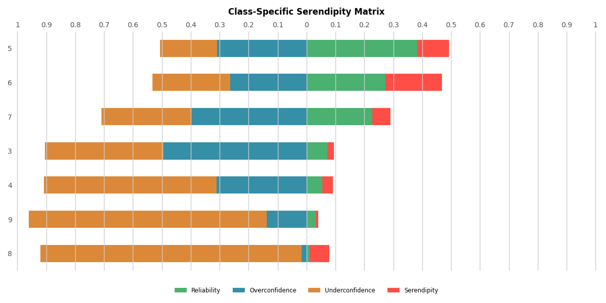
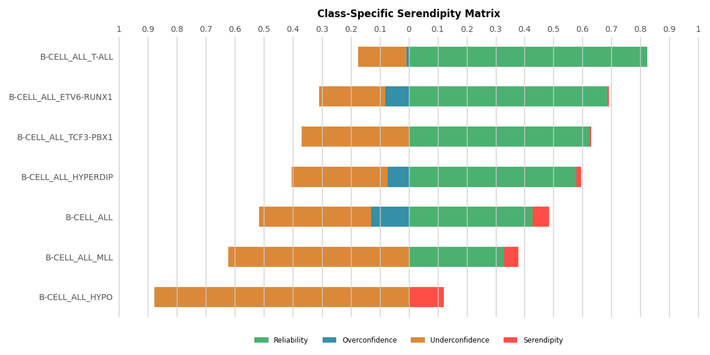

# Usage Example

## Without cross-validation

```python
from serendipity_matrix import *
import numpy as np
from sklearn.naive_bayes import GaussianNB
from ucimlrepo import fetch_ucirepo 

if __name__ == '__main__':
    # Loads the dataset
    wine_quality  = fetch_ucirepo(id=186) 
    X, y = wine_quality.data.features, wine_quality.data.targets.squeeze()

    # Training and predict
    model = GaussianNB().fit(X, y)
    result = model.predict_proba(X)

    # Calculates and prints the class-independent serendipity matrix
    ci_matrix = class_indep_matrix(y, result)
    print(ci_matrix)

    # Calculates and prints the class-specific serendipity matrix
    cs_matrix = class_spec_matrix(y, result)
    print(cs_matrix)

    # Plots the class-specific serendipity matrix
    plot_class_spec(y, result)
```

### Results

#### Class-independent serendipity matrix

|Reliability|Overconfidence|Underconfidence|Serendipity|
|:---------:|:------------:|:-------------:|:---------:|
|  0.26401  |    0.29623   |    0.318717   |  0.021864 |

#### Class-specific serendipity matrix

|CLASS_NAME|Reliability|Overconfidence|Underconfidence|Serendipity|
|:--------:|:---------:|:------------:|:-------------:|:---------:|
|    3     |  0.072567 |  0.493307    |    0.412262   |  0.021864 |
|    4     |  0.054267 |  0.310598    |    0.597766   |  0.037369 |
|    5     |  0.383453 |  0.308486    |    0.198692   |  0.109368 |
|    6     |  0.272532 |  0.264399    |    0.267862   |  0.195207 |
|    7     |  0.227578 |  0.400299    |    0.308644   |  0.063479 |
|    8     |  0.010690 |  0.017746    |    0.902782   |  0.068782 |
|    9     |  0.031477 |  0.137502    |    0.822256   |  0.008765 |

#### Class-specific serendipity matrix horizontal bar chart



## With cross-validation

```python
from serendipity_matrix import *
import numpy as np
from sklearn.ensemble import RandomForestClassifier
from sklearn.model_selection import StratifiedKFold

K = 10
class_col = "type" 
file = "Leukemia_GSE28497.csv"

if __name__ == '__main__':
    # Reads the file
    dataset = pd.read_csv(file)

    # Prepares the dataset
    dataset = dataset.drop(columns="samples")
    
    X = dataset.drop(columns=class_col)
    y = dataset[class_col]

    # Initializes the variables for the results
    aggregated_y = np.array([])
    aggregated_result = np.empty((0, len(np.unique(y))))

    # Initializes the validation model
    kf = StratifiedKFold(K, random_state=0, shuffle=True)
    for train, test in kf.split(X, y):
        # Splits in train and test
        X_train, y_train = X.iloc[train], y.iloc[train]
        X_test, y_test = X.iloc[test], y.iloc[test]

        # Training and predict
        model = RandomForestClassifier(random_state=0).fit(X_train, y_train)
        result = model.predict_proba(X_test)

        # Aggregates y_test and the results
        aggregated_y = np.concatenate((aggregated_y, y_test)).flatten()
        aggregated_result = np.concatenate((aggregated_result, result))
    
    # Calculates and prints the class-independent serendipity matrix
    ci_matrix = class_indep_matrix(aggregated_y, aggregated_result)
    print(ci_matrix)
    
    # Calculates and prints the class-specific serendipity matrix
    cs_matrix = class_spec_matrix(aggregated_y, aggregated_result)
    print(cs_matrix)

    # Plots the class-specific serendipity matrix
    plot_class_spec(aggregated_y, aggregated_result)
```

### Results

#### Class-independent serendipity matrix

|Reliability|Overconfidence|Underconfidence|Serendipity|
|:---------:|:------------:|:-------------:|:---------:|
|  0.545196 |    0.064199  |    0.359395   |  0.03121  |

#### Class-specific serendipity matrix

|     CLASS_NAME      |Reliability|Overconfidence|Underconfidence|Serendipity|
|:-------------------:|:---------:|:------------:|:-------------:|:---------:|
|     B-CELL ALL      |  0.427132 |  0.130020    |    0.385359   |  0.057488 |
|B-CELL ALL ETV6-RUNX1|  0.686533 |  0.081184    |    0.228271   |  0.004011 |
| B-CELL ALL HYPERDIP |  0.578813 |  0.073820    |    0.330135   |  0.017231 |
|   B-CELL ALL HYPO   |      0    |      0       |    0.878891   |  0.121109 |
|    B-CELL ALL MLL   |  0.328914 |      0       |    0.621843   |  0.049242 |
|   B-CELL ALL T-ALL  |  0.823984 |  0.007509    |    0.168507   |     0     |
| B-CELL ALL TCF3-PBX1|  0.623776 |      0       |    0.370163   |  0.006061 |

#### Class-specific serendipity matrix horizontal bar chart


